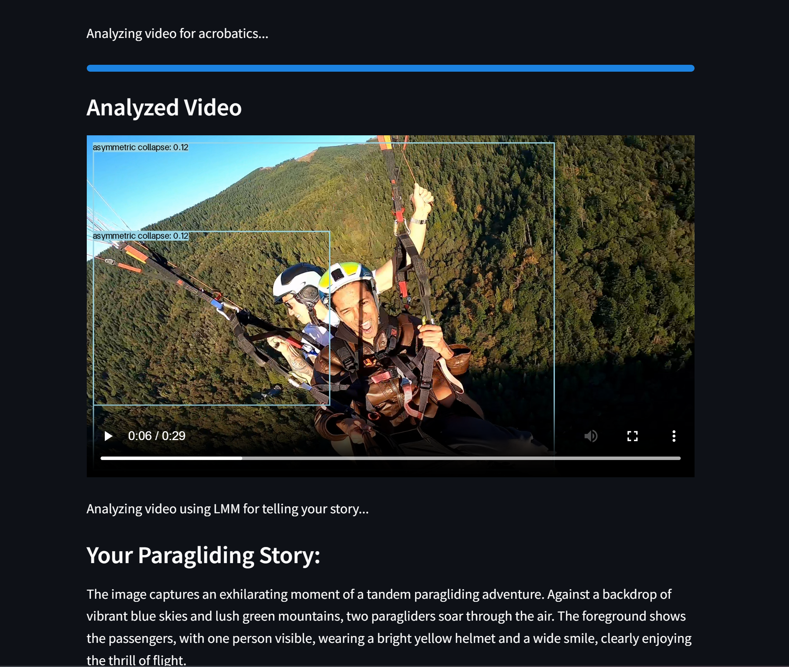

# Paragliding Safety Detection & Video Analysis App

This application leverages **VisionAgent** for AI-powered image and video analysis, aimed at ensuring safety during paragliding activities. The app detects safety gear, identifies acrobatic maneuvers, and generates descriptive analyses of videos.

---

## Features

1. **Safety Gear Detection (Image Analysis)**
   - Upload an image to detect essential safety gear, such as helmets, harnesses, gloves, footwear, and parachutes.
   - The system visually highlights detected items with bounding boxes and displays checkmarks or crosses to indicate if the required safety gear is present.

2. **Acrobatics Detection & Video Analysis**
   - Upload a 30-second video for frame-by-frame analysis.
   - Detects acrobatic maneuvers like spiral dives, wing overs, full stalls, and asymmetric collapses.
   - Annotates and saves the analyzed video for playback directly within the app.

3. **Deep Captioning & Storytelling (LMM)**
   - Uses Large Multimodal Models (LMM) to generate detailed descriptions of the uploaded video.
   - Provides text-based summaries to understand the context and key moments of the recorded session.

---

## Setup Instructions

### Prerequisites
- Docker
- Python 3.8+
- VisionAgent API Keys (Anthropic and OpenAI)

### Installation

1. **Clone the Repository**
   ```bash
   git clone https://github.com/your-username/VisionAgent.git
   cd VisionAgent
   ```

2. **Set up Environment Variables**
   - Create a `.env` file with your API keys:
     ```
     OPENAI_API_KEY=your-openai-key
     ANTHROPIC_API_KEY=your-anthropic-key
     ```

3. **Build and Run with Docker**
   ```bash
   docker-compose up --build
   ```

4. **Install Dependencies (if running locally)**
   ```bash
   pip install -r requirements.txt
   ```

---

### Running the Application
- Access the Streamlit app on your local browser:
  ```
  http://localhost:8501
  ```

## Example Screenshots

### **Annotated Image Output**
  
*Detected safety gear items with bounding boxes.*

---

### **Safety Checklist**
  

---

### **Annotated Video Analysis**
  


## File Structure

```
├── Dockerfile
├── docker-compose.yml
├── app.py
├── requirements.txt
├── sample_img_to_upload.JPG
├── annotated_img.png
├── analysed_vid.png
├── safety_list.png
└── README.md
```

---

## License
This project is licensed under the MIT License.

## Contributing
Contributions are welcome! Please open an issue or submit a pull request for any improvements.
